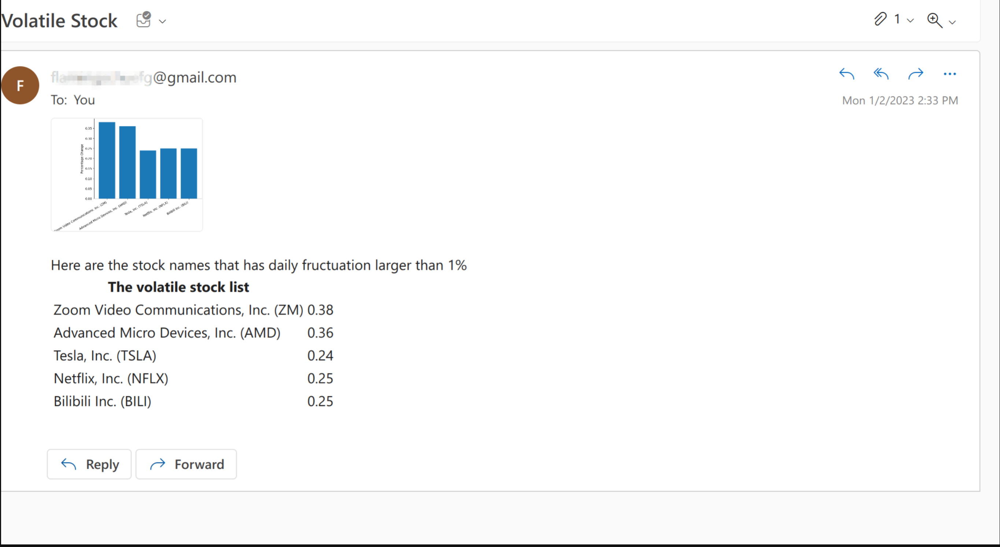

# Web Crawling Yahoo Finance with Scrapy

### 1. The scrapy is used to extract information from yahoo finance website to obtain the stock infomration
### 2. A python script is created to clean the information and then use sendGrid to send out the email automatically to notify about the stock price percentage changes. The information includes the table and a graph
### 3. a shell script and crontab are used to schedule the work to run periodically.\

## The Final email output will be looking like below:
